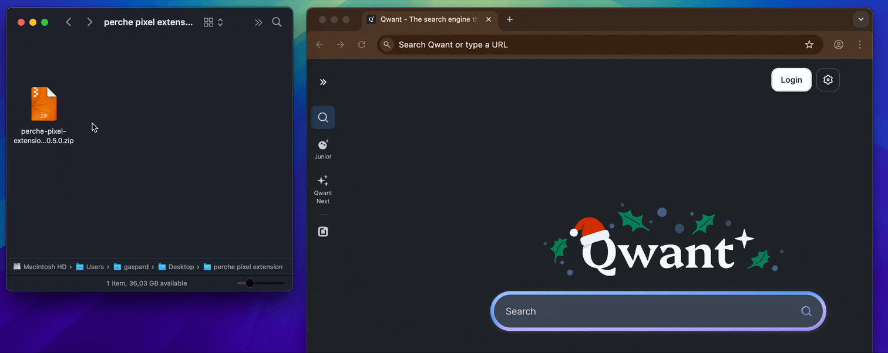

Perche-pixel-extenion spanws an editor on wplace

## Usage
* Unzip the file
* Go to the url "chrome://extensions/" using chrome or brave
* enable "developer mode"
* drop the dist folder on chrome

## Contribute

### Install locally

1. Run `pnpm install` (you may have to install pnpm globally: `npm install -g pnpm`)
2. Run `pnpm update-version <version>` for change the `version` to the desired version of your extension.

1. Run:
    - Dev: `pnpm dev` (on Windows, you should run as administrator;
      see [issue#456](https://github.com/Jonghakseo/chrome-extension-boilerplate-react-vite/issues/456))
    - Prod: `pnpm build`
2. Open in browser - `chrome://extensions`
3. Check - <kbd>Developer mode</kbd>
4. Click - <kbd>Load unpacked</kbd> in the upper left corner
5. Select the `dist` directory from the boilerplate project

### Chrome extension 

The extension lives in the `chrome-extension` directory and includes the following files:

- [`manifest.ts`](chrome-extension/manifest.ts) - script that outputs the `manifest.json`
- [`src/background`](chrome-extension/src/background) - [background script](https://developer.chrome.com/docs/extensions/mv3/background_pages/)
  (`background.service_worker` in manifest.json)
- [`public`](chrome-extension/public/) - icons referenced in the manifest; content CSS for user's page injection

> [!IMPORTANT]
> To facilitate development, the boilerplate is configured to "Read and change all your data on all websites".
> In production, it's best practice to limit the premissions to only the strictly necessary websites. See
> [Declaring permissions](https://developer.chrome.com/docs/extensions/develop/concepts/declare-permissions)
> and edit `manifest.js` accordingly.

### Pixel-editor 
located in `packages/pixel-editor` it is derived from (perche-draw)[https://github.com/gasp/perche-draw] and can be run as standalone with `pnpm --filter @extension/pixel-editor dev`

### Pages 

Code that is transpiled to be part of the extension lives in the [pages](pages) directory.

- [`content`](pages/content) - Scripts injected into specified pages (You can see it in console)
- [`content-ui`](pages/content-ui) - React Components injected into specified pages (You can see it at the very bottom of pages)
- [`content-runtime`](pages/content-runtime/src/) - [injected content scripts](https://developer.chrome.com/docs/extensions/develop/concepts/content-scripts#functionality)
  This can be injected from e.g. `popup` like standard `content`

### Packages 

Some shared packages:

- `dev-utils` - utilities for Chrome extension development (manifest-parser, logger)
- `env` - exports object which contain all environment variables from `.env` and dynamically declared
- `hmr` - custom HMR plugin for Vite, injection script for reload/refresh, HMR dev-server
- `shared` - shared code for the entire project (types, constants, custom hooks, components etc.)
- `storage` - helpers for easier integration with [storage](https://developer.chrome.com/docs/extensions/reference/api/storage), e.g. local/session storages
- `tailwind-config` - shared Tailwind config for entire project
- `tsconfig` - shared tsconfig for the entire project
- `ui` - function to merge your Tailwind config with the global one; you can save components here
- `vite-config` - shared Vite config for the entire project

Other useful packages:

- `zipper` - run `pnpm zip` to pack the `dist` folder into `extension-YYYYMMDD-HHmmss.zip` inside the newly created
  `dist-zip`
- `module-manager` - run `pnpm module-manager` to enable/disable modules
- `e2e` - run `pnpm e2e` for end-to-end tests of your zipped extension on different browsers

## Troubleshooting

### Hot module reload seems to have frozen

If saving source files doesn't cause the extension HMR code to trigger a reload of the browser page, try this:

1. Ctrl+C the development server and restart it (`pnpm run dev`)
2. If you get a [`grpc` error](https://github.com/Jonghakseo/chrome-extension-boilerplate-react-vite/issues/612),
   [kill the
   `turbo` process](https://github.com/Jonghakseo/chrome-extension-boilerplate-react-vite/issues/612#issuecomment-2518982339)
   and run `pnpm dev` again.

### Imports not resolving correctly

If you are using WSL and imports are not resolving correctly, ensure that you have connected VS Code to WSL remotely using the [Remote - WSL](https://marketplace.visualstudio.com/items?itemName=ms-vscode-remote.remote-wsl) extension.

## Debugging

If you're debugging one, you can use [Brie](https://go.briehq.com/github?utm_source=CEB) lets you capture screenshots, errors, and network activity, making it easier for us to help.

## Reference

- [Chrome Extensions](https://developer.chrome.com/docs/extensions)
- [Vite Plugin](https://vitejs.dev/guide/api-plugin.html)
- [Rollup](https://rollupjs.org/guide/en/)
- [Turborepo](https://turbo.build/repo/docs)
- [Rollup-plugin-chrome-extension](https://www.extend-chrome.dev/rollup-plugin)

